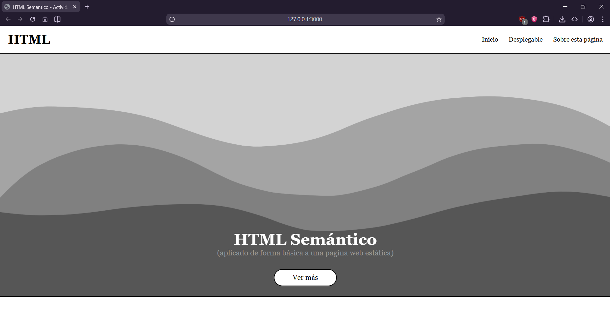
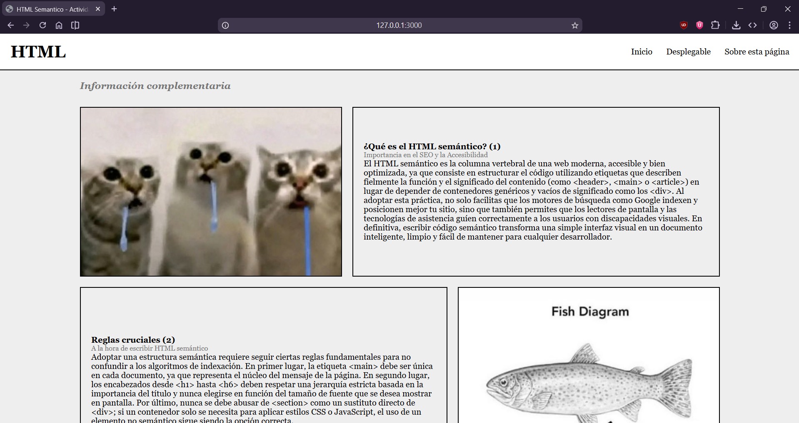
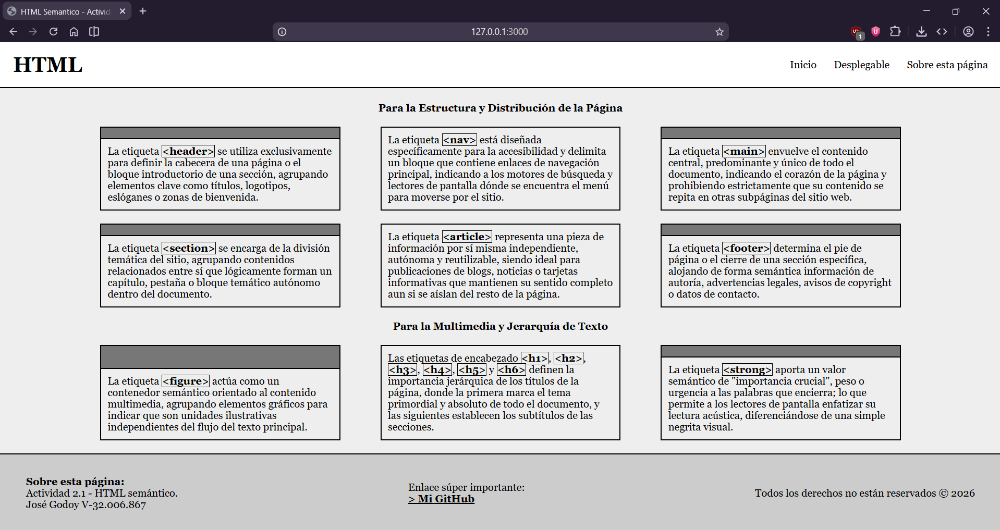

# Actividad 2.1 - Diseño Web con HTML
#### FrontEndI2026B - Universidad Valle del Momboy
---
**Alumno:** José Godoy V-32.006.867
---
Por favor, visitar el [Enlace al video](https://youtu.be/Wrx_L0IbD7k)
(el video está oculto, ya que al ponerlo público youtube me lo baja)

### Actividad:
> Realizar un sitio web que contenga la semántica HTML y utilice la mayoría de etiquetas HTML explicadas en clase, incluyendo etiquetas de archivos multimedia en la web.

### Página realizada:

---
